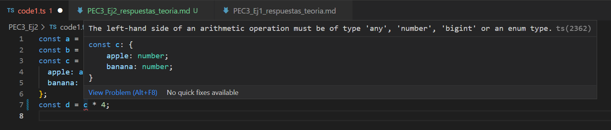
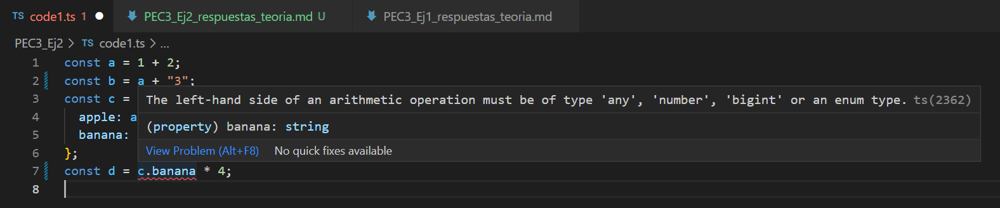

**Modifica el código para conseguir que aparezca una línea roja de error en el IDE avisándote de que se está disparando un TypeError . Toma una captura de pantalla de tu resultado y haz que se muestre dentro del fichero PEC3_Ej2_respuestas_teoria.md (0.5 puntos). Dentro de este mismo documento explica por qué se ha producido esto y qué ventajas tiene.**
Se han simulado dos ejemplos que generan un error de tipo de variable. El primero, que podemos ver a continuación, es un error debido a que en la última línea se está multiplicando la variable *c*, que es de tipo objeto, por 4 que es un número. Lo que de un error de tipo:

En el segundo ejemplo, se hace que la variable *b* sea de tipo *string*, concatenando *a* con un *string*. Entonces si cambiamos la última línea también y hacemos que se multiplique la variable *b*, nos da otra vez un error de tipo al no poder multiplicar un *string*:

**Para cada uno de los valores del fichero code2.ts, ¿Qué tipo de datos inferirá TypeScript? Explica por qué se ha inferido este tipo de datos.**
La variable *a* es un número. Las variables *b* y *c* son *strings*. La variable *d* es un *array* de *booleanos*. La variable *e* es un objeto. Las variables *f* y *g* son *arrays* pero la *f* contiene un número y un *booleano*, mientras que *g* contiene solo un número. La variable *h* es de tipo *null*. Aunque, para las variables de la *d* a la *g*, si hacemos un typeof nos sale que son de tipo objecto. Y la *h* nos sale como *undefined*.

**¿Por qué se dispara cada uno de los errores del fichero code3.ts?**
El error de la variable *i* sale porqué se está intentando modificar el valor de una constante, a la cual, una vez se le ha asignado un valor ya no puede modificarse.
El de la variable *j* ocurre porqué ésta se ha declarado como un *array* de números y por lo tanto no se puede añadir un *string* al *array*.
El de la variable *k* es porqué el valor de número no es asignable al tipo *never*.
El de la *m* es porque se está intentando multiplicar un valor de tipo *unknown* por otro número y esto no es posible.

**¿Cuál es la diferencia entre una clase y una interface en TypeScript?**
Las clases son esencialmente necesarias para contener la implementación de diferentes objetos con diferentes propiedades y métodos asociados con ellos. Las clases pueden tener propiedades inicializadas y tener implementaciones de varios métodos dentro de ellas y pueden usarse para inicializar o crear diferentes objetos.

Las interfaces solo se utilizan para contener la información de tipo de varios atributos correspondientes a un objeto. Generalmente se usa para la verificación de tipos y, por lo tanto, para evitar errores de tiempo de ejecución y no se puede usar para la creación de instancias de objetos.